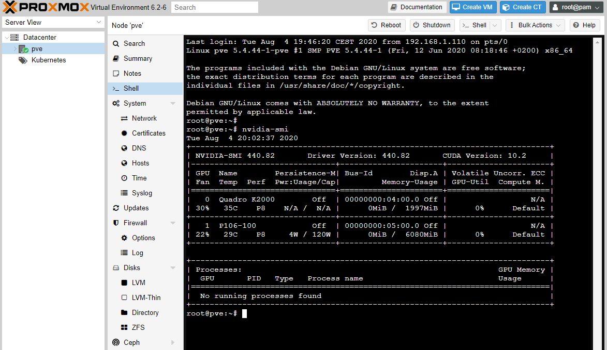
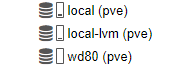
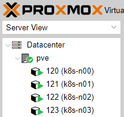
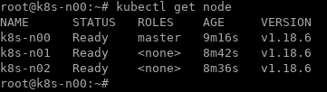
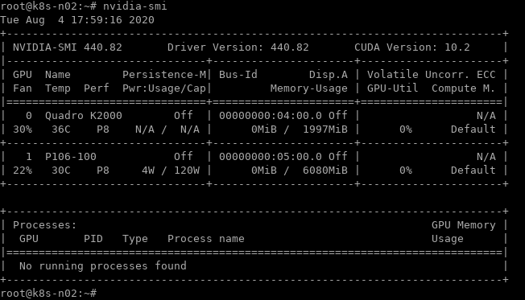
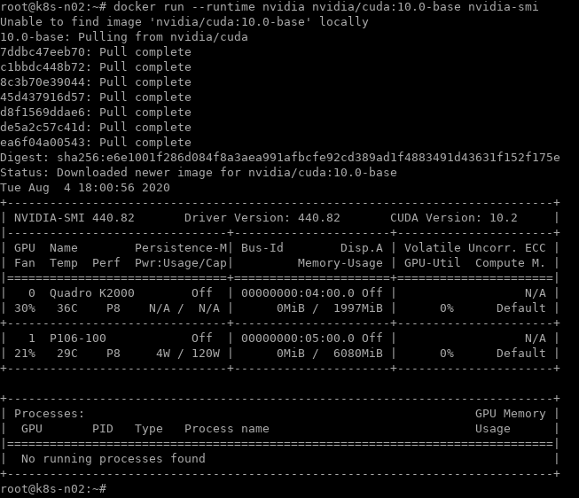

# pve-k8s

Provision 3 lxc nodes k8s cluster on Proxmox using ansible.

## prerequisites 

1. proxmox host 


2. NVidia GPU configured on proxmox 



[reference on how to install nvidia-driver on proxmox](https://medium.com/@MARatsimbazafy/journey-to-deep-learning-nvidia-gpu-passthrough-to-lxc-container-97d0bc474957)

3. Ansible ready machine [example - setting ansible](./docs/ex_ansible_setting.md)


## Procedures in playbook 

1. provision 3 lxc containers - `provision_3_lxc_ct.yml` 

2. ( Optional ) mount shared disks - `mount_shared_disks.yml`

For simple home lab setup : map shared directory lab into all lxc containers

```bash
root@pve:/mnt/pve/wd80/private# tree -L 2
.
└── lab          --> lxc:/lab
    ├── dataset  
    ├── k8s-n00  
    ├── k8s-n01
    ├── k8s-n02
    └── share
```

example - storage on proxmox 

 


3. fine tuning lxc configuration for k8s - `prepare_k8s_lxc.yml'

4. install docker - `install_docker_inside_lxc.yml` 

5. install nvidia drivers - `install_nvidia_driver_gpu_nodes.yml`

   ( Note! : the same version of the driver should be installed on proxmox host )
   
   [Install nvidia driver on proxmox host](https://www.passbe.com/2020/02/19/gpu-nvidia-passthrough-on-proxmox-lxc-container/)

6. passthrough gpu - `gpu_passthrough_lxc.yml`

7. install nvidia-docker - `install_nvidia_docker_gpu_nodes.yml`

8. setup k8s master node - `setup_k8s_master.yml`

9. setup k8s worker nodes - `setup_k8s_workers.yml`

10. setup k8s plugins (flannel network, helm, nvidia gpu plugin ) - `setup_k8s_plugins.yml`


## Run provisioning

```bash
$ cd playbooks
$ ansible-playbook -e @vars.yml -i inventory.ini ansible_build_k8s.yml
```

## Remove provisioned resources 

```bash
$ cd playbooks
$ ansible-playbook -e @vars.yml -i inventory.ini ansible_purge_k8s.yml
```

## Check containers and k8s cluster





### Check GPU 




### Check nvidia docker 




## References 

proxmox pct command [pct manual](https://pve.proxmox.com/pve-docs/pct.1.html)

docker in lxc [docker in lxc](https://discuss.linuxcontainers.org/t/working-install-of-docker-ce-in-lxc-unprivileged-container-in-proxmox/3828)

Bootstrap-kubernetes-with-LXC https://github.com/zimmertr/Bootstrap-Kubernetes-with-LXC

Kubernetes-nvidia-ansible-playbook https://github.com/mrdeanplumbley/kubernetes-nvidia-ansible-playbook 

NVIDIA-docker https://github.com/NVIDIA/nvidia-docker#quickstart

