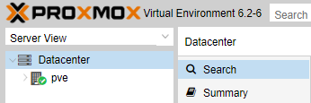

# pve-k8s

Provision 3 lxc nodes k8s cluster on Proxmox using ansible.

## prerequisites 




A machine in which you would run ansible script. 

```bash 
apt install ansible
ssh-copy-id root@proxmox
```


contents in /etc/ansible/hosts 

```bash
[proxmox]
192.168.1.101
```

Check ansible connection to host

```
$ ansible proxmox -u root -m ping
[WARNING]: Platform linux on host 192.168.1.101 is using the discovered Python interpreter at /usr/bin/python, but future installation of another Python interpreter could change this. See
https://docs.ansible.com/ansible/2.9/reference_appendices/interpreter_discovery.html for more information.
192.168.1.101 | SUCCESS => {
    "ansible_facts": {
        "discovered_interpreter_python": "/usr/bin/python"
    },
    "changed": false,
    "ping": "pong"
}

$ ansible proxmox -u root -a "/bin/echo hello "
[WARNING]: Platform linux on host 192.168.1.101 is using the discovered Python interpreter at /usr/bin/python, but future installation of another Python interpreter could change this. See
https://docs.ansible.com/ansible/2.9/reference_appendices/interpreter_discovery.html for more information.
192.168.1.101 | CHANGED | rc=0 >>
hello
```

or edit inventory.ini 

```bash
[proxmox]
192.168.1.101
```

```bash
$ ansible proxmox -i inventory.ini -u root -a "/bin/echo hello "
[WARNING]: Platform linux on host 192.168.1.101 is using the discovered Python interpreter at /usr/bin/python, but future installation of another Python interpreter could change this. See
https://docs.ansible.com/ansible/2.9/reference_appendices/interpreter_discovery.html for more information.
192.168.1.101 | CHANGED | rc=0 >>
hello
```

```bash
ansible-playbook -e @vars.yml -i inventory.ini build_k8s.yml
```


## Provisioning 3 lxc containers 

1. 

2. 

3. 


## Configure lxc containers 


